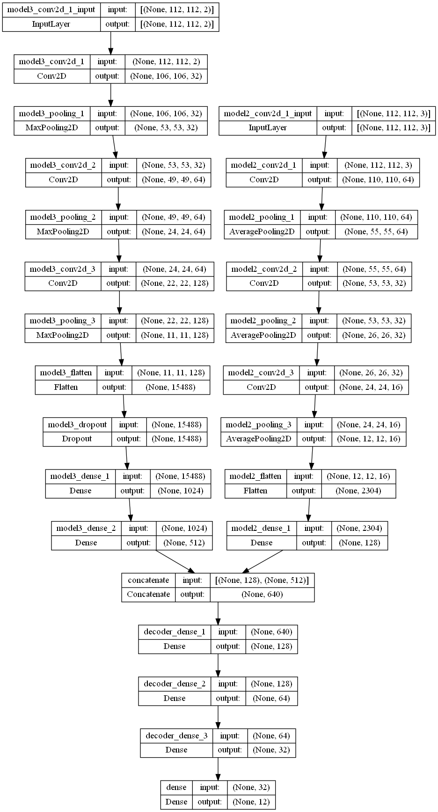
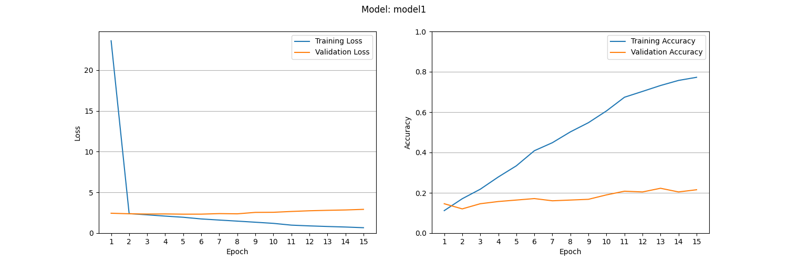
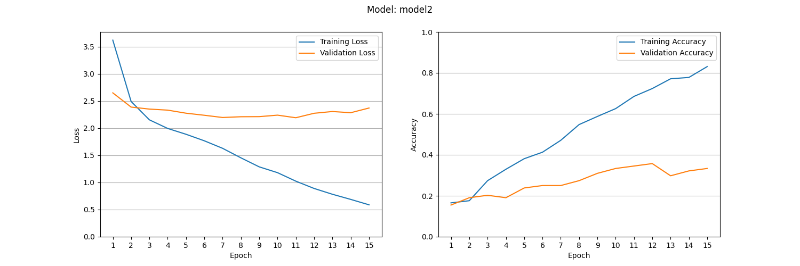
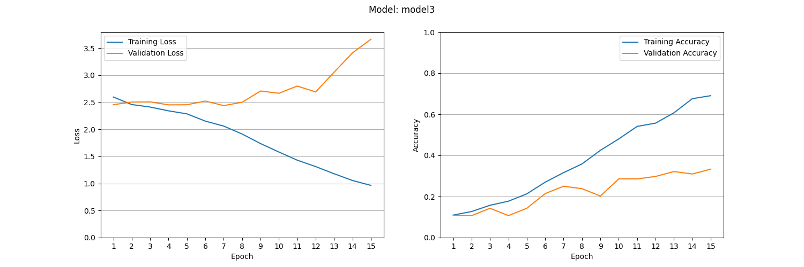
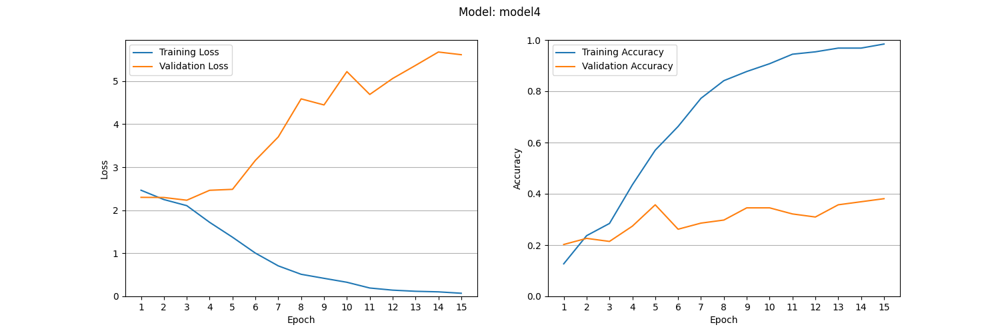

# ComputerVisionOpticalFlow

Assignment 5 of the computer vision course, using CNNs for action recognition.

## Data preparation

1. Run `data_preparation_stanford.py` to make the `./data/Stanford40.pickle` file.
2. Run `data_preparation_HMDB.py` to make the `./data/hmdb.pickle` file.

Run any of the train scripts to generate the final data pickels. This is done automatically and cached to disk.

Very basic data analysis is done in `data_analysis.ipynb` to verify that the data is correct.

## Training

1. Stanford 40 – Frames: Run `train_models.py`
2. HMDB51 – Frames (transfer learning): Run `train_models_hmdb.py` and change `model_variation` to `model2`
3. HMDB51 – Optical flow: Run `train_models_hmdb.py` and change `model_variation` to `model3`
4. HMDB51 – Two-stream: Run `train_models_twostream.py`

## Evaluation

Accuracy/loss graphs can be generated with the `evaluate.py` script. Images are stored in `./img`.

## Two-stream model architecture

## Accuracy/Loss graphs

